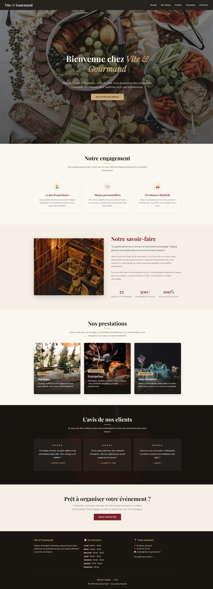
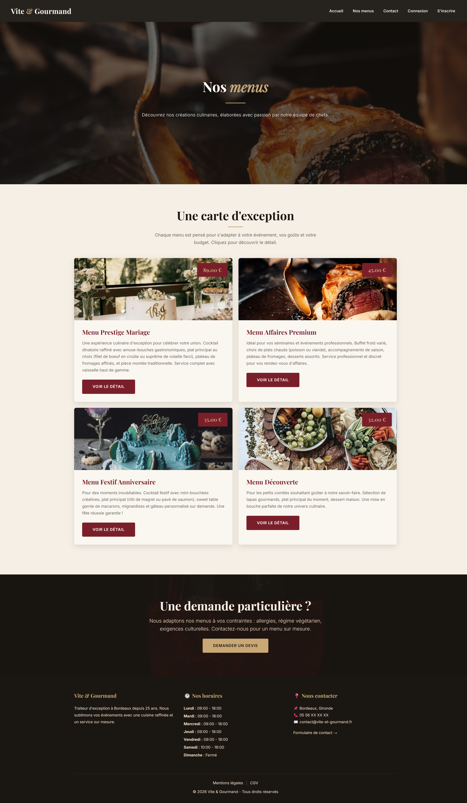
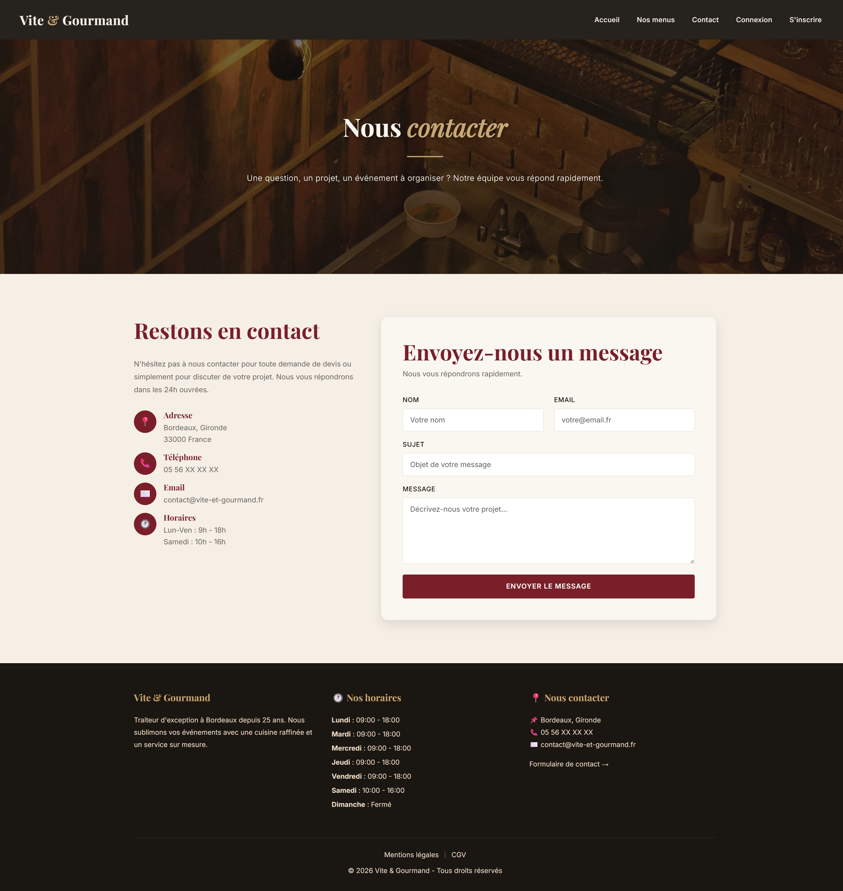
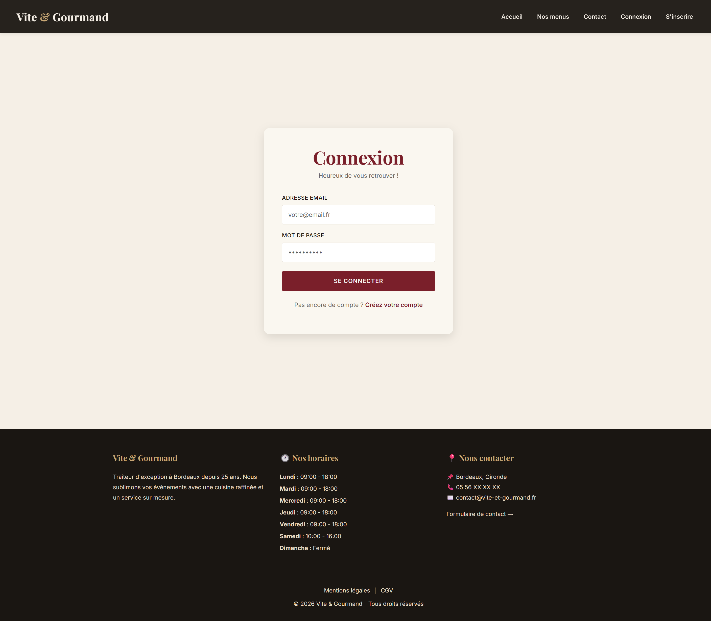
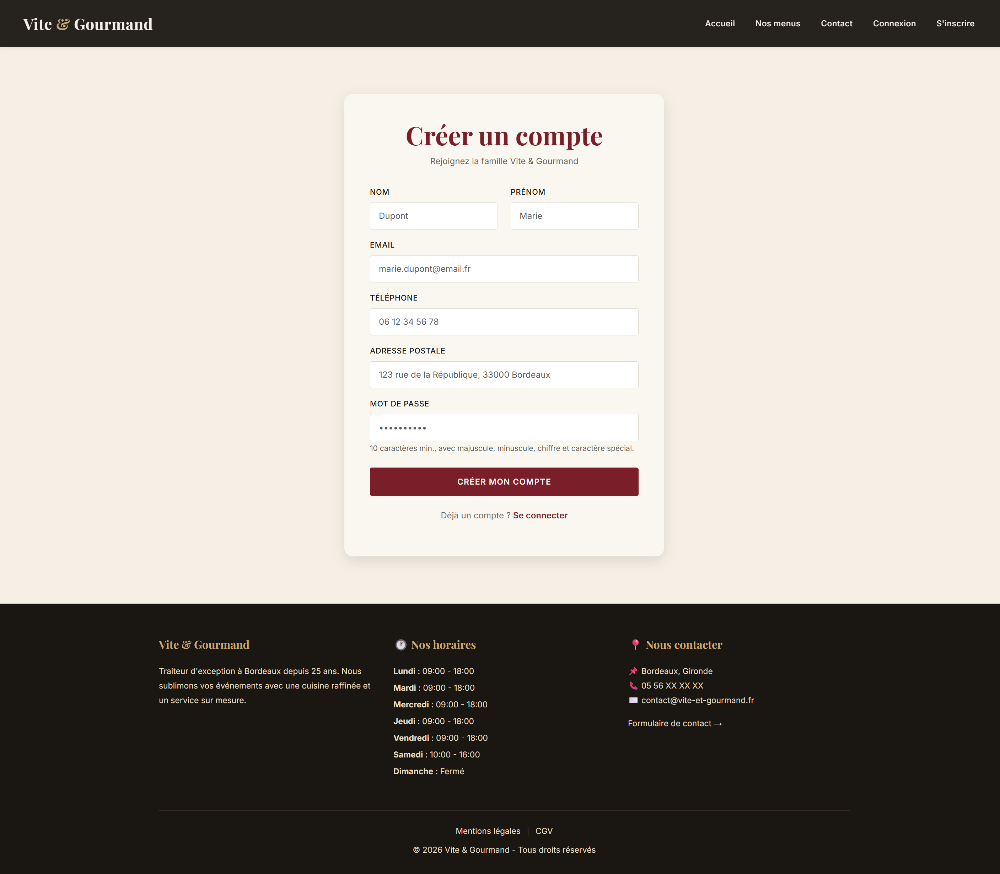
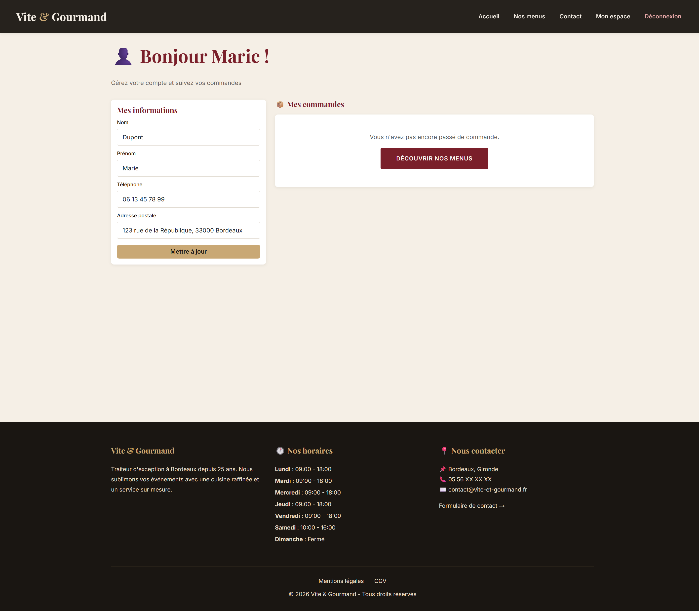
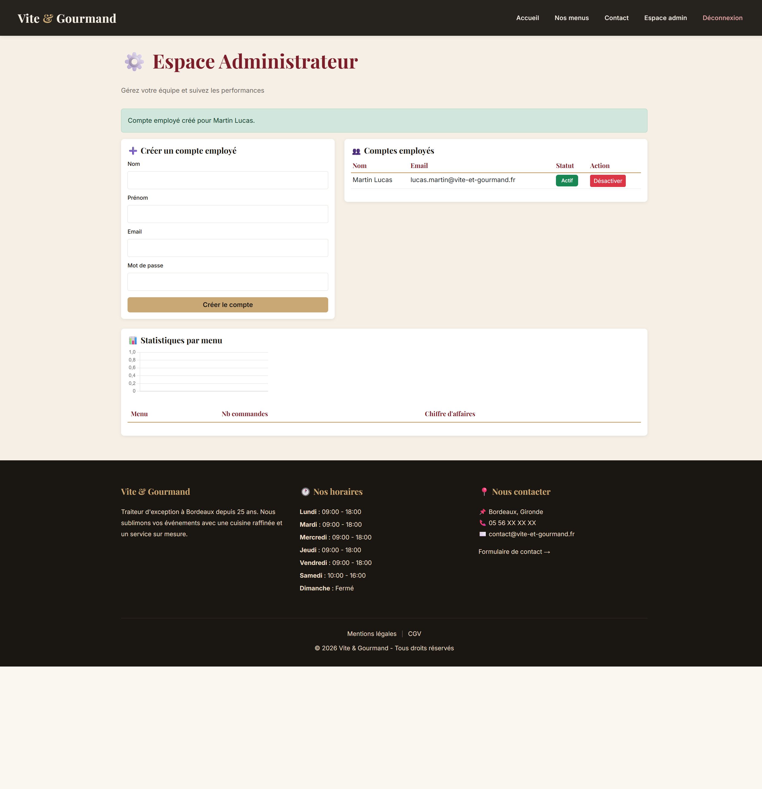

# Vite & Gourmand 🍽️

Application web d'un traiteur fictif basé à Bordeaux, développée dans le cadre de
l'Évaluation en Cours de Formation (ECF) du **Titre Professionnel Développeur Web et Web
Mobile** (RNCP 37674) chez Studi.

Le site permet aux visiteurs de consulter les menus, aux clients de passer et suivre leurs
commandes, et propose des espaces de gestion dédiés aux employés et à l'administrateur.

- **Dépôt GitHub :** https://github.com/dquinzin1-jpg/vite-et-gourmand
- **Application déployée :** https://dp-vite-et-gourmand.alwaysdata.net
- **Suivi de projet (Kanban) :** https://github.com/users/dquinzin1-jpg/projects/1

---

## ✨ Fonctionnalités

**Espace public (visiteurs)**
- Page d'accueil (présentation de l'entreprise, avis clients validés)
- Catalogue des menus avec **filtres dynamiques sans rechargement** (prix, thème, régime, nombre de personnes)
- Vue détaillée d'un menu, page de contact, mentions légales et CGV
- Inscription et connexion

**Espace client**
- Tableau de bord personnalisé et gestion des informations personnelles
- Passage de commande avec calcul du prix en temps réel (réduction de 10 % à partir de « minimum + 5 » personnes, frais de livraison hors Bordeaux : 5 € + 0,59 €/km)
- Historique et suivi des commandes, dépôt d'un avis sur les commandes terminées

**Espace employé**
- Visualisation et filtrage des commandes (par statut, par client)
- Mise à jour des statuts de commande, modération des avis

**Espace administrateur**
- Gestion des comptes employés (activation / désactivation)
- Gestion complète des menus (CRUD)
- Statistiques de vente par menu (graphique Chart.js alimenté par MongoDB)

---

## 🛠️ Stack technique

| Domaine | Technologies |
|---|---|
| Back-end | PHP 8, PDO |
| Base relationnelle | MySQL (local) / MariaDB 11.4 (production) |
| Base non relationnelle | MongoDB Atlas (statistiques) |
| Front-end | HTML5, CSS3, Bootstrap 5, JavaScript (vanilla), Chart.js |
| Outils | Git / GitHub, VS Code, XAMPP, AlwaysData, FileZilla (SFTP) |

---

## 🚀 Installation en local

### Prérequis
- [XAMPP](https://www.apachefriends.org/) (Apache + MySQL/MariaDB + PHP 8)
- [Git](https://git-scm.com/)

### Étapes

1. **Cloner le dépôt** dans le dossier `htdocs` de XAMPP :
   ```bash
   cd C:\xampp\htdocs
   git clone https://github.com/dquinzin1-jpg/vite-et-gourmand.git
   ```

2. **Démarrer les services** Apache et MySQL depuis le panneau de contrôle XAMPP.

3. **Créer et importer la base de données** via phpMyAdmin (http://localhost/phpmyadmin) :
   - Créer une base nommée `vite_et_gourmand`.
   - Importer le fichier `database/database.sql` (structure et données de base).
   - Importer le fichier `database/seed-data.sql` (données de démonstration).

4. **Configurer l'environnement** : copier le modèle de configuration et l'adapter.
   ```bash
   copy config\.env.example config\.env
   ```
   Les valeurs locales par défaut (`DB_LOCAL_USER=root`, mot de passe vide) conviennent à une
   installation XAMPP standard.

5. **Accéder à l'application** :
   ```
   http://localhost/vite-et-gourmand
   ```

> **Note sur les statistiques (MongoDB) :** le graphique de statistiques de l'espace
> administrateur s'appuie sur MongoDB. Son affichage nécessite l'extension PHP `mongodb` et un
> fichier `config/mongodb.php` (non versionné). En l'absence de cette configuration, le site
> reste pleinement fonctionnel : seule cette section de statistiques n'est pas affichée.

---

## 🔑 Comptes de test

| Rôle | Identifiant | Mot de passe |
|---|---|---|
| Administrateur | `admin@vite-et-gourmand.fr` | `Admin1234!` |

Les comptes employé et client peuvent être créés depuis l'application (l'administrateur crée
les employés ; un visiteur s'inscrit comme client).

---

## 📦 Structure du projet

```
vite-et-gourmand/
├── assets/        # CSS, JS, images
├── config/        # Connexion BDD (db.php) et configuration (.env, non versionné)
├── database/      # Scripts SQL : structure (database.sql) et données (seed-data.sql)
├── docs/          # Charte graphique, manuel, maquettes, diagrammes UML, documentations
├── includes/      # En-tête, pied de page, navigation, helper d'envoi de mail
├── pages/         # Pages de l'application (menus, commande, espaces, etc.)
└── index.php      # Page d'accueil
```

---

## 🌐 Déploiement

L'application est déployée sur **AlwaysData** (PHP 8.4 + MariaDB 11.4), les fichiers étant
transférés par **SFTP** (FileZilla) et la base importée via phpMyAdmin. La procédure complète
est détaillée dans `docs/documentation-technique.pdf`.

Le fichier `config/db.php` détecte automatiquement l'environnement (local ou production) et
charge la configuration adaptée, sans modification manuelle du code.

---

## 📸 Captures d'écran

### 🌐 Pages publiques

#### 🏠 Page d'accueil


#### 🍽️ Nos menus


#### 📧 Contact


### 🔐 Authentification

#### 🔑 Connexion


#### 📝 Inscription


### 👥 Espaces personnalisés selon les rôles

#### 👤 Espace utilisateur


#### 🛠️ Espace administrateur


#### 👨‍🍳 Espace employé


---

## 🤖 Mention de l'usage de l'intelligence artificielle

Par souci de transparence envers le jury : l'assistant IA **Claude (Anthropic)** a été utilisé
comme **tuteur pédagogique** tout au long du projet (aide à la conception, au code et à la
documentation). Le code a été compris, testé et validé par mes soins, et l'ensemble des choix
techniques reste documenté et défendable.