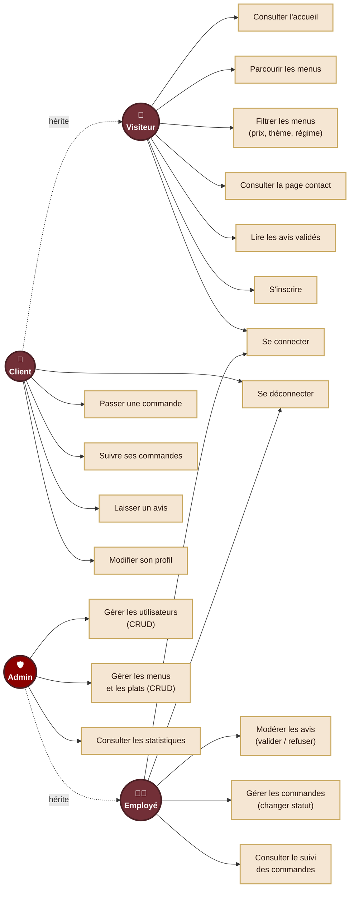

# Diagramme de cas d'utilisation — Vite & Gourmand

Ce diagramme représente les interactions des 4 acteurs (Visiteur, Client, Employé, Admin) avec le système.

## Légende
- 👤 **Visiteur** : utilisateur non connecté
- 🛒 **Client** : utilisateur connecté avec rôle "client"
- 👨‍🍳 **Employé** : utilisateur connecté avec rôle "employe"
- 🛡️ **Admin** : utilisateur connecté avec rôle "admin"

> Les rôles héritent : Client hérite de Visiteur, Admin hérite de Employé.

## Diagramme

## Notes

- Les flèches pleines (`-->`) représentent les associations directes entre un acteur et un cas d'utilisation.
- Les flèches pointillées (`-.->`) avec le label "hérite" représentent la généralisation entre acteurs : un Client peut faire tout ce qu'un Visiteur peut faire + ses propres cas, idem pour Admin par rapport à Employé.
- Les couleurs reprennent la palette du site : bordeaux pour les acteurs standards, rouge foncé pour l'admin, crème/or pour les cas d'utilisation.