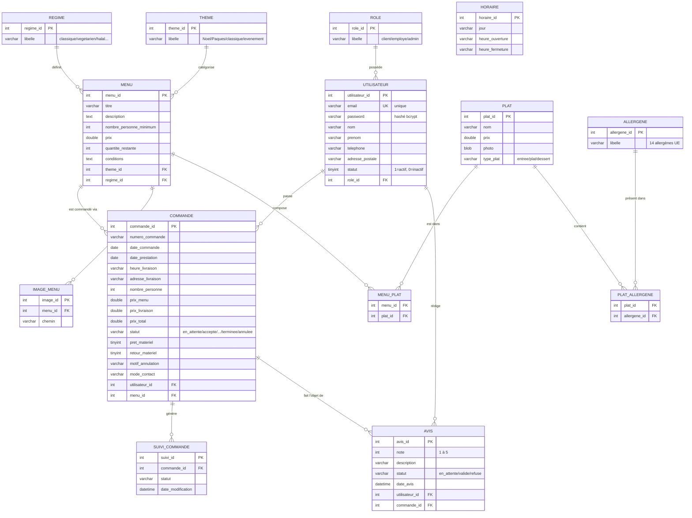

# Diagramme de classes / MCD enrichi — Vite & Gourmand

Modèle Conceptuel de Données représentant les **14 tables** de la base de données MySQL/MariaDB (hébergée sur AlwaysData), avec leurs attributs, types et cardinalités.

## Légende des cardinalités (notation Mermaid / Chen)

- `||--o{` : Un (et un seul) vers Zéro ou plusieurs
- `||--||` : Un vers Un
- `}o--||` : Zéro ou plusieurs vers Un

## Diagramme

## Notes techniques

### Conventions
- **PK** = Primary Key (clé primaire) — convention de nommage : `<nom_table>_id`
- **FK** = Foreign Key (clé étrangère)
- **UK** = Unique Key (contrainte d'unicité)

### Choix d'architecture
- La table **HORAIRE** est indépendante : elle stocke les horaires d'ouverture du traiteur (informations affichées en pied de page), sans rattachement à un utilisateur particulier.
- La relation `AVIS → COMMANDE` (et non `AVIS → MENU`) garantit qu'un avis est lié à une **commande réellement passée**. Cela empêche les faux avis : un utilisateur ne peut laisser un avis que sur un menu qu'il a commandé.
- Les tables **PLAT_ALLERGENE** et **MENU_PLAT** sont des **tables de liaison** (associations many-to-many) avec clés primaires composites.
- Le champ `password` de **UTILISATEUR** est stocké hashé avec `password_hash()` PHP (algorithme bcrypt par défaut).
- Le champ `email` de **UTILISATEUR** a une contrainte d'unicité pour éviter les doublons d'inscription.
- Le champ `statut` de **UTILISATEUR** (tinyint) permet la désactivation logique d'un compte sans suppression (soft delete).
- Le champ `quantite_restante` de **MENU** permet de gérer un stock limité par menu (utile pour les menus saisonniers/évènementiels).
- Le workflow de modération des avis : `en_attente` → `valide` ou `refuse` (gestion par les employés).
- Le workflow d'une commande : `en_attente` → `accepte` → `en_preparation` → `en_cours_de_livraison` → `livre` → `en_attente_retour_materiel` (si applicable) → `terminee` (ou `annulee` à n'importe quelle étape).

### Stack et types
- SGBD : **MariaDB 11.4.9** (compatible MySQL)
- Encodage : **utf8mb4** (support complet des emojis et caractères spéciaux)
- Moteur : **InnoDB** (support des transactions et clés étrangères)
- Accès depuis PHP : **PDO** (PHP Data Objects) avec requêtes préparées pour prévenir les injections SQL.