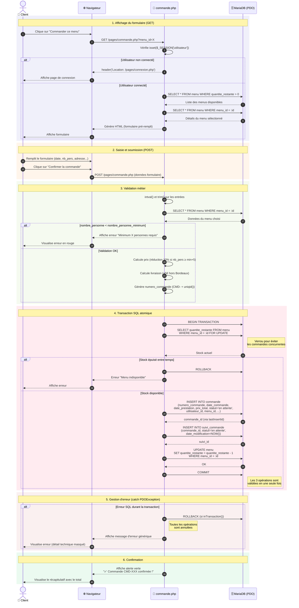

# Diagramme de séquence — Passer une commande

Ce diagramme représente le workflow complet d'un client passant une commande de menu sur la plateforme Vite & Gourmand, depuis l'accès à la page jusqu'à la confirmation finale en base de données.

## Acteurs et composants

- **Client** : utilisateur connecté avec rôle "client"
- **Navigateur** : interface web (HTML/CSS/JS Bootstrap)
- **commande.php** : page PHP unique qui gère à la fois l'affichage du formulaire (GET) et son traitement (POST)
- **Base de données MariaDB** : accessible via PDO (PHP Data Objects)

## Diagramme

## Notes techniques

### Architecture du fichier

- **Pattern "GET pour afficher / POST pour modifier"** : la page `commande.php` gère les deux méthodes HTTP dans un seul fichier. Cela simplifie la maintenance et le routage.
- **Authentification** : vérification de `$_SESSION['utilisateur']` dès l'entrée du script. Redirection automatique vers `connexion.php` si non connecté.

### Sécurité des données

- **Requêtes préparées PDO** : utilisation systématique de `prepare()` + `execute()` avec des paramètres nommés (`:id`, `:user_id`, etc.) pour prévenir les injections SQL.
- **Nettoyage des entrées** : `intval()` pour les entiers (menu_id, nombre_personne) et `trim()` pour les chaînes (adresse).
- **Échappement à l'affichage** : `htmlspecialchars()` sur toutes les variables affichées dans le HTML (prévention XSS).

### Atomicité — Transaction SQL

L'opération de création de commande regroupe **3 opérations interdépendantes** :

1. `INSERT INTO commande` (création de la commande principale)
2. `INSERT INTO suivi_commande` (création du premier suivi avec statut `en attente`)
3. `UPDATE menu SET quantite_restante = quantite_restante - 1` (décrémentation du stock)

Ces 3 opérations sont encapsulées dans une **transaction SQL** (`beginTransaction()` / `commit()`). Si l'une d'elles échoue, le bloc `catch (PDOException $e)` déclenche un `rollBack()` qui **annule toutes les opérations**, garantissant la cohérence de la base de données. Sans transaction, on pourrait par exemple avoir une commande créée sans son suivi, ou un stock décrémenté sans commande associée.

### Concurrence — Verrou ligne (`FOR UPDATE`)

La requête `SELECT ... FOR UPDATE` pose un **verrou exclusif** sur la ligne du menu pendant la durée de la transaction. Cela empêche les **race conditions** : si deux clients soumettent leur commande exactement au même instant alors qu'il ne reste qu'un seul exemplaire, le second client sera mis en attente, lira le stock actualisé à 0, et recevra le message d'erreur "Menu indisponible" plutôt que de provoquer une survente.

### Numéro de commande

Le numéro est généré côté serveur avec `'CMD-' . strtoupper(uniqid())`. La fonction `uniqid()` PHP retourne un identifiant unique basé sur le timestamp microseconde, ce qui garantit l'absence de collision même en cas de commandes simultanées.

### Logique métier

- **Prix dégressif** : si le nombre de personnes commandées est supérieur ou égal au minimum + 5, une réduction automatique de 10% est appliquée.
- **Livraison gratuite Bordeaux** : la fonction `stripos()` détecte le mot "bordeaux" dans l'adresse de livraison (insensible à la casse). Si absent, +5€ de frais sont ajoutés au prix total.
- **Statut initial** : toute commande nouvellement créée a le statut `en attente`. Elle suivra ensuite le workflow géré par les employés/admins (`accepte` → `en preparation` → `en cours de livraison` → `livre` → `terminee`), avec un enregistrement dans `suivi_commande` à chaque changement de statut.

### Évolutions prévues

- **Protection CSRF** : ajouter un token unique généré à l'affichage du formulaire et vérifié à la soumission pour empêcher les attaques par requête falsifiée (Cross-Site Request Forgery).
- **Validation renforcée** : utiliser `filter_var()` avec des filtres spécifiques (FILTER_VALIDATE_EMAIL, FILTER_SANITIZE_STRING, etc.) pour une validation plus rigoureuse des entrées utilisateur.
- **Notification email** : envoi automatique d'un email de confirmation au client après création de la commande (via PHPMailer ou la fonction `mail()` PHP).
- **Logging** : enregistrement des erreurs PDO dans un fichier de log côté serveur via `error_log()`, sans exposer les détails techniques côté client.